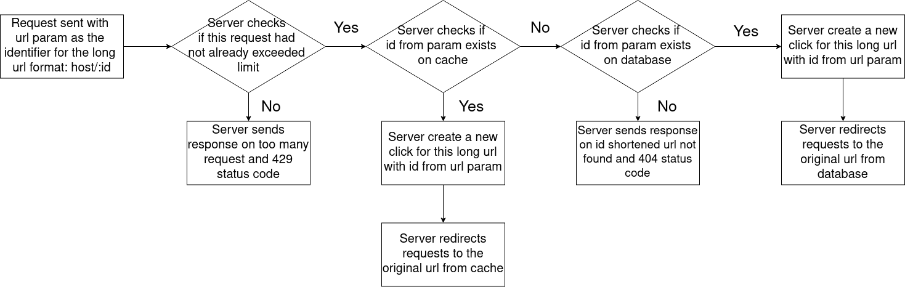

# Pendekin Web App

 

## Description

 

This web app allows user to type in a long url and in return would get a short url that points to the original url.

## Entity Relation Diagram

 

## Application Flows

### Application flow of user creating a shortened URL

 

### Application flow of somebody clicked the shortened URL

 

### Application Flow of user requesting data on number of people clicked the shortened url

 

## List of Available Endpoints

### GET /:urlId
- Description: 
This endpoints redirects user to the original long-url

### POST /urls
- Description:
This endpoints create a new short url

### GET /urls/:urlId
- Description:
This endpoints get the number of people clicked the shortened-url